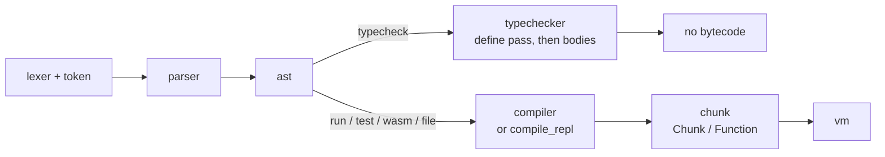
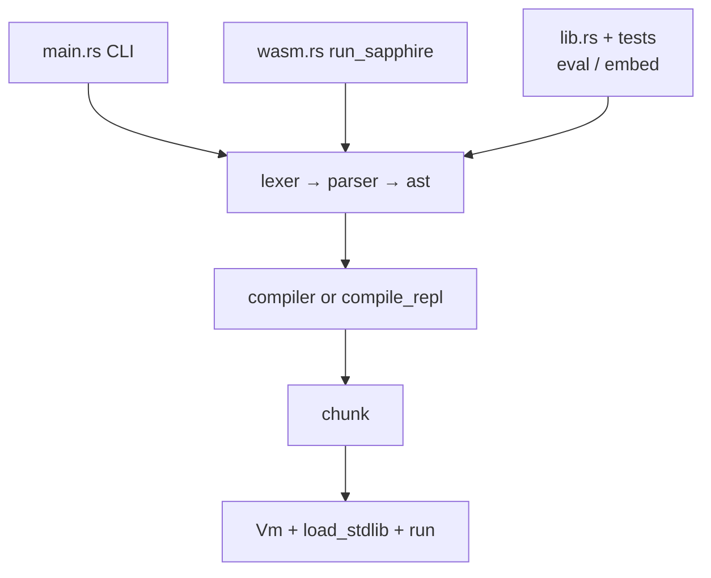
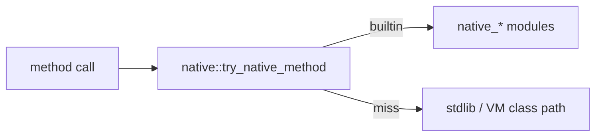

# Sapphire architecture

Sapphire is a Ruby-inspired, gradually typed, object-oriented scripting language, implemented as a single Rust crate (`sapphire`) with an optional CLI. **User code always lowers to bytecode and runs on a stack VM**; there is no AST-walking interpreter on the hot path.

This page is a **map of the repo and runtime**—where phases live in `src/`, how the CLI and WASM entry points connect, and what each major module owns.

## Crate layout

### Repo paths and `src/` entrypoints

| Path | Role |
|------|------|
| `stdlib/` | Standard library `.spr` sources under `stdlib/src/`; Sapphire tests live under `stdlib/tests/` and `tests/` |
| `tests/` | Rust integration tests (VM, lexer, imports, stdlib) |
| `examples/` | Sample programs and `run_all.sh` for smoke runs |
| `scripts/ci` | Aggregates `cargo test`, `clippy`, `sapphire test stdlib/tests`, and examples |
| `src/main.rs` | CLI (`run`, `typecheck`, `test`, `console`, `version`) when built with the `cli` feature |
| `src/lib.rs` | Public modules for embedding, tests, and the WASM build |
| `src/wasm.rs` | `wasm-bindgen` entry (`run_sapphire`) — same pipeline as CLI, captures printed output |

### `src/` modules (compiler, VM, builtins)

Each row is `src/<module>.rs` (except `lexer` / `token`, two files).

| Module | Responsibility |
|--------|----------------|
| `lexer` / `token` | Scanning and token taxonomy |
| `parser` | Recursive descent; method/field access and zero-arg call sugar |
| `ast` | Surface syntax tree: expressions, methods/classes, blocks |
| `typechecker` | Two-pass typecheck after parse (definitions, then bodies) |
| `compiler` | AST → opcodes (e.g. `Foo.new` → `OpCode::NewInstance`) |
| `chunk` | `OpCode`, constant pool, `Function`, upvalue metadata |
| `value` | Chunk constants (`Value`) — primitives only at compile time |
| `vm` | Operand stack, dispatch, `VmValue`, imports, class registry, I/O hooks |
| `gc` | Mark-and-sweep heap (`GcHeap`, `GcRef`, `Trace`) |
| `native` | Shared helpers (`primitive_class_name`, comparisons) and native dispatch |
| `native_*` | Per-type builtins (`native_int`, `native_list`, `native_string`, …) |
| `datetime` | Date/time via **jiff**, wired into VM values / heap as needed |
| `error` | Parse, compile, and VM error types |

## Execution pipeline

- **`typecheck`** stops after `typechecker.rs`; no `Chunk` is built.
- **`compile_repl`** is the REPL compiler entry; it targets the same `Chunk` + VM contract as file compilation.

After compilation, the CLI path is: `Vm::new` (import root = script directory) → `load_stdlib()` → `run()`.

### Entry points

The **frontend** (source → AST) is the same wherever you enter; **embedding, WASM, and tests** skip `main.rs` but still use the same compiler and `Vm`.

## Cargo features

- **`cli` (default)** — `sapphire` binary with `rustyline` for `console`.
- **`wasm`** — `wasm` module and `run_sapphire`; stdlib load path matches CLI semantics; `Vm` import base is empty.

## Builtin dispatch

`native::try_native_method` tries Rust builtins first; on miss, execution continues into stdlib-defined class methods.

## Runtime model

- **`VmValue`** (`vm.rs`): runtime tags for primitives, collections, ranges, closures, classes, instances, bound methods, native callables.
- **Imports**: `./` / `../` relative to `current_dir`; `.spr` implied; canonical paths dedupe so each file loads once. REPL / empty base disables imports.
- **Stdlib**: sources under `stdlib/src/` embedded as strings, evaluated in `load_stdlib()` (see `docs/adding-stdlib-class.md`).
- **GC**: heap objects implement `Trace`; `Vm` supplies roots (see `docs/gc.md`).

## Testing

- **Rust** (`tests/`): `eval`, `eval_with_stdlib`, `eval_err`, etc.
- **Sapphire** (`*_test.spr`): `Test` subclasses from `stdlib/src/test.spr`; `sapphire test` discovers them recursively (`stdlib/tests` in CI).

## Further reading

- **`AGENT.md`** — commands, CI, and in-repo conventions.
- **`docs/adding-stdlib-class.md`** — native-backed stdlib classes.
- **`docs/tutorial.md`** — language tutorial (not implementation).
