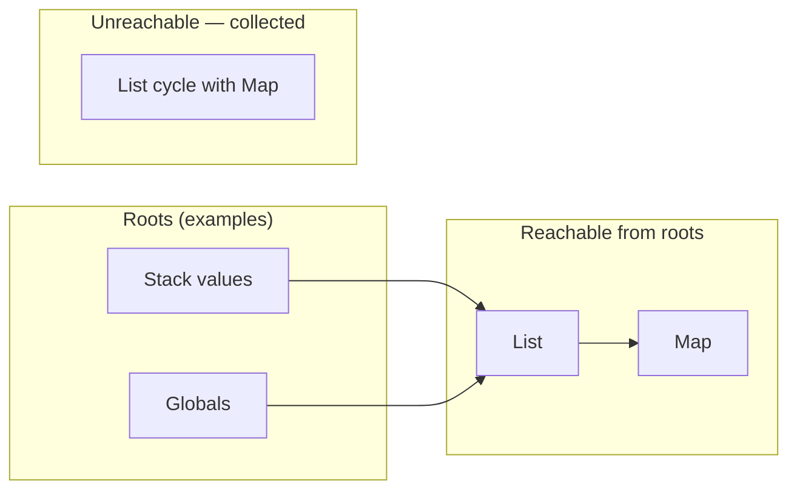
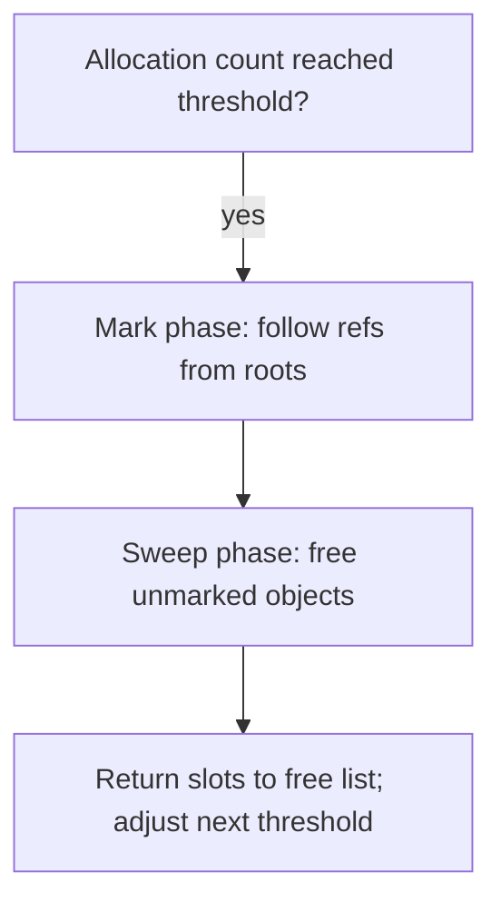

# Garbage collection

## Introduction

Sapphire’s **VM** keeps small, call-scoped data on its **stack** and puts **lists, maps, sets, and per-instance field tables** on a shared **heap** so they can outlive a frame, be shared across references, and embed other heap objects. The runtime uses **mark-and-sweep** over that heap: periodically it traces from **roots**, frees everything unreachable, and reuses slots.

This document is about **how that applies in this codebase**—which values live where, what counts as a root, and how collection is triggered—not a general tutorial on garbage collection. You can skim Part 1 for the VM model and Part 2 for the Rust types and call sites.

---

## Part 1 — Sapphire’s heap model

### Stack vs heap

- **Stack** — Operand stack and call bookkeeping: what the current (and suspended) execution can touch directly without indirection through `GcRef`.
- **Heap** — `GcRef`-backed objects: lists, maps, sets, and `Fields` maps for object instances. They can be aliased, stored in globals, and hold other `VmValue`s (including nested `GcRef`s).

Integers, booleans, and other non-heap `VmValue` variants are not separate GC objects; they may still **contain** `GcRef`s transitively when they sit inside heap structures.

### Reachability and roots

The collector treats a heap slot as **live** iff it is reachable from the **root set** the VM passes into `collect`. In practice that means: anything the program could still observe by walking references from operands, globals, closed upvalues, or class metadata that holds default field values.

**Cycles** are handled like any other graph: if the cycle has no path from a root, the whole cycle is collected together.

### Mark-and-sweep and pauses

1. **Mark** — From each root, follow `GcRef` edges (via `Trace` / `collect_refs`) and set mark bits on every visited object.
2. **Sweep** — Scan heap slots; unmarked occupied slots are dropped and their indices go on a **free list** for reuse.

Collections are **stop-the-world**: the VM does not run Sapphire bytecode during `collect`. Pause length grows with live heap size and graph depth, not with “every opcode.”

### Correctness note

If a live `GcRef` were omitted from the root set, the sweep phase could free it. The implementation gathers roots from the operand stack (all slots), globals, closed upvalues, and class field defaults so that anything still reachable from executing user code is traced.

---

## Part 2 — Implementation details

This section matches the code in `src/gc.rs` and `src/vm.rs`.

### Types

- **`GcRef`**: `u32` index into `GcHeap::objects`.
- **`GcHeap<T: Trace>`**: mark-and-sweep heap; Sapphire uses `T = HeapObject`.
- **`Trace`**: heap objects implement `trace` to push every **child** `GcRef` into the collector’s worklist during marking.

**`HeapObject`** (`vm.rs`) variants:

- `List(Vec<VmValue>)`
- `Map(HashMap<String, VmValue>)`
- `Set(Vec<VmValue>)`
- `Fields(HashMap<String, VmValue>)` — instance field storage

`VmValue` stores `GcRef` for `List`, `Map`, `Set`, and for `Instance { fields, .. }`. Other `VmValue` variants are not heap slots in this collector but may **contain** `GcRef` transitively inside the structures above.

### Tracing edges from a value

**`collect_refs`** (`vm.rs`) adds **direct** child `GcRef`s from a `VmValue`: list/map/set handles, and the `fields` handle on `Instance`. The **`Trace` impl on `HeapObject`** walks every `VmValue` stored inside that object and calls the same idea recursively via the worklist inside `GcHeap::collect`.

### `GcHeap::collect` algorithm

1. Clear all mark bits.
2. **Mark**: iterative DFS from the `roots` slice—pop a `GcRef`, skip if out of range or already marked, mark, call `obj.trace(&mut worklist)`.
3. **Sweep**: for each slot, if occupied and unmarked, drop the value and push the index on a **free list**.
4. Set **`threshold`** to `max(live_count * 2, 256)` and reset **`allocated`** to `0` (see `collect` in `gc.rs`).

Storage is `Vec<Option<T>>`; **`alloc`** reuses free-list indices before growing the vector.

### Roots: `Vm::gc_roots`

When `Vm::maybe_gc` runs a collection, roots are built from:

- Every `VmValue` on the **operand stack** (`collect_refs` each).
- Every value in **`globals`** (REPL / `GetGlobal` / `SetGlobal`).
- **Closed upvalues** in each frame (`UpvalueState::Closed`).
- **Class field defaults** in the class registry (values stored with compiled class entries).

Locals still on the stack are covered because **all stack slots** are scanned, not only TOS. Open upvalues that still reference stack slots do not need a separate root list if the captured value is still present on the stack.

### When collection runs

`Vm::maybe_gc` calls **`heap.collect(&roots)`** when **`heap.should_collect()`** (`allocated >= threshold`). The VM invokes `maybe_gc` immediately before **`alloc_list`**, **`alloc_map`**, **`alloc_set`**, and **`alloc_fields`**.

Some **native** Rust code calls **`heap.alloc`** directly (e.g. list results from string methods). Those calls still increment the allocation counter; the next `maybe_gc` on a VM `alloc_*` path may run collection if the threshold was exceeded.

### Cycles

Unreachable cycles are collected: marking only follows edges from roots via `Trace`, so a cycle with no external path from roots is never marked and is swept.

### Related code

- `src/gc.rs` — `GcHeap`, `Trace`, `collect`
- `src/vm.rs` — `HeapObject`, `collect_refs`, `gc_roots`, `maybe_gc`, `alloc_*`
